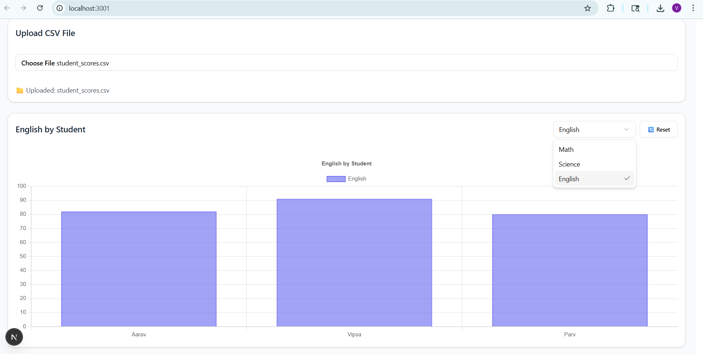

# 📊 InsightBoard.AI  
### _Intelligent Data Insight Dashboard with AI-Powered Analytics_

[]



---

## 🚀 Overview

**InsightBoard.AI** is an interactive, AI-driven data dashboard that transforms raw CSV files into intelligent insights — think of it as **ChatGPT for your analytics**.  
Upload your CSV → visualize trends instantly → ask AI questions → download a professional PDF report with charts and summaries.

---

## 🧠 Key Features

✅ **CSV Upload & Auto Visualization** – Upload any CSV and get instant charts  
✅ **Dynamic Chart Selection** – Switch between numeric columns interactively  
✅ **AI-Powered Insights** – Ask natural questions like _“Which student scored highest in Science?”_  
✅ **Voice Input** – Speak your questions (hands-free query)  
✅ **PDF Report Export** – Download AI summary + chart in one click  
✅ **Clean Modern UI** – Built with ShadCN UI + TailwindCSS  
✅ **Secure API Handling** – OpenAI key stored safely via environment variables  
✅ **Fully Deployed on Vercel** – Fast, serverless hosting with zero config  

---

## 🧩 Tech Stack

| Category | Tools / Libraries |
|-----------|------------------|
| **Framework** | Next.js 16 (App Router), React 18, TypeScript |
| **Styling / UI** | Tailwind CSS, ShadCN UI |
| **Data Handling** | PapaParse (CSV Parser) |
| **Charts & Analytics** | Chart.js |
| **AI Integration** | OpenAI API (`gpt-4o-mini`) |
| **Voice Recognition** | react-speech-recognition |
| **Report Generation** | html2canvas, jsPDF |
| **Hosting / CI-CD** | Vercel |
| **Version Control** | Git & GitHub |

---

## ⚙️ Local Setup & Installation

### 1️⃣ Clone Repository
```bash
git clone https://github.com/<your-username>/insightboard-ai.git
cd insightboard-ai


### 2️⃣ Install Dependencies
```bash
npm install

### 3️⃣ Add Environment Variable
```bash
OPENAI_API_KEY=sk-your-secret-key

### 4️⃣ Run Development Server
```bash
npm run dev

## 🔒 Security Note
⚠️ Note: The live demo uses my personal OpenAI API key for limited testing.
AI functionality may stop once the $5 free credit expires.
Please run locally with your own key for full access.